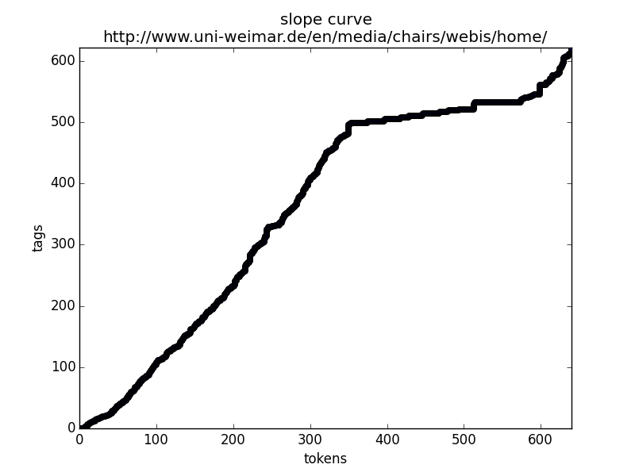
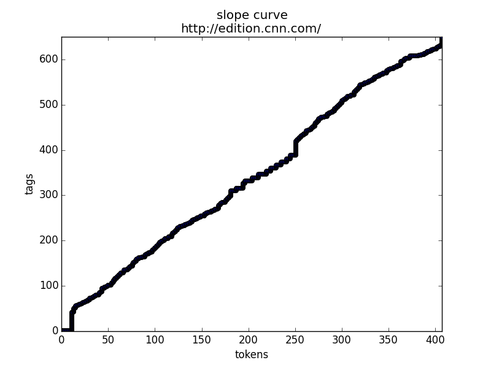
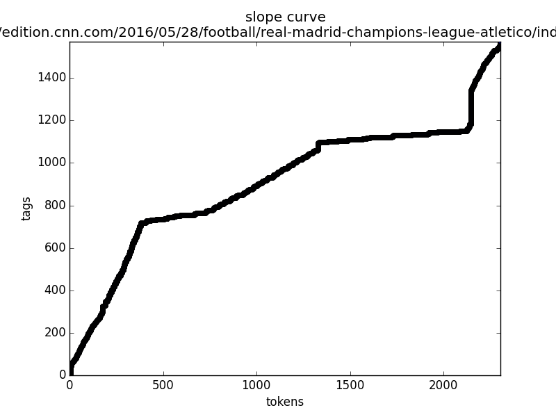
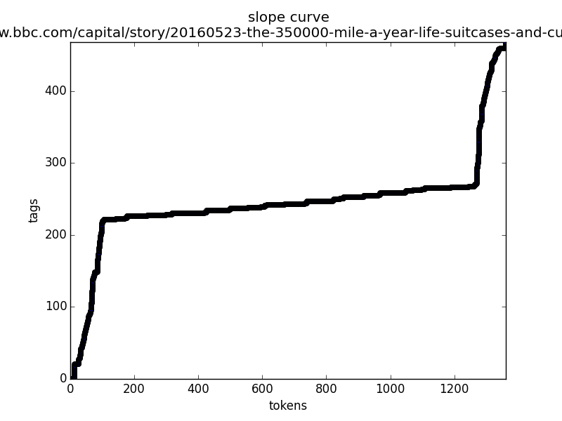

#Web Search and Information Retrieval
###May 19, 2016
#Problem set 2

###Exercise 1 : Storing
Plot the document slope curves for a sample of web pages.
Test the accuracy of the simple optimization algorithm for detecting the main
content block.

http://edition.cnn.com/2016/05/28/football/real-madrid-champions-league-atletico/index.html

http://www.bbc.com/capital/story/20160523-the-350000-mile-a-year-life-suitcases-and-culture-shock

See "dls" folder for more examples.

###Exercise 2 : Storing
1. bytesum
    Not collision free, exchanging bytes will lead to same bytesum.
2. cksum
    Not cryptographically secure but appropiate for our usecase. Easy to forge same cksum for two different files.
3. sha1sum
    Like cksum but even harder to forge.
    
