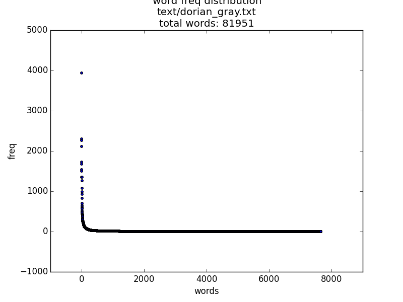
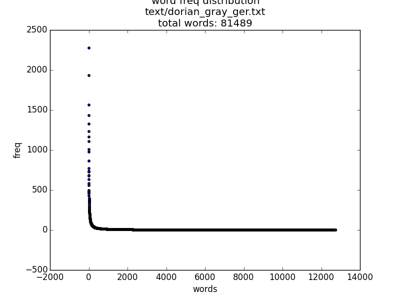
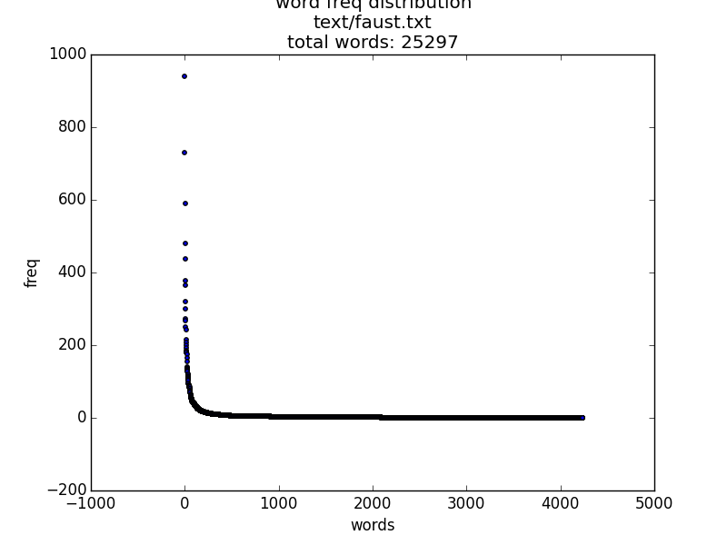
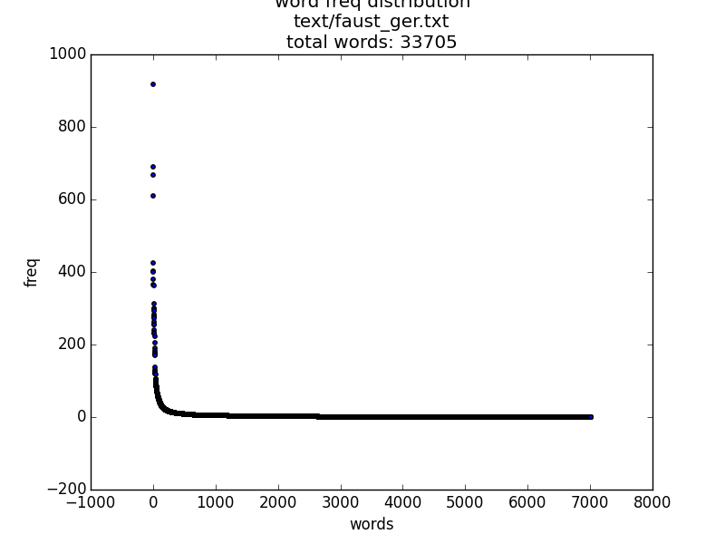

#Web Search and Information Retrieval
###May 19, 2016
#Problem set 2

###Exercise 1 : Storing
Plot the document slope curves for a sample of web pages.
Test the accuracy of the simple optimization algorithm for detecting the main
content block.

http://edition.cnn.com/2016/05/28/football/real-madrid-champions-league-atletico/index.html

http://www.bbc.com/capital/story/20160523-the-350000-mile-a-year-life-suitcases-and-culture-shock

See "dls" folder for more examples.

###Exercise 2 : Storing
1. bytesum
    Not collision free, exchanging bytes will lead to same bytesum.
2. cksum
    Not cryptographically secure but appropiate for our usecase. Easy to forge same cksum for two different files.
3. sha1sum
    Like cksum but even harder to forge.
    
###Exercise 3 : Storing
Write a program to generate fingerprints for documents.
Report on the accuracy of the detection (precision and recall of the approach).

	md5_sum dups
	precision: 85.714286 recall: 15.929204

	simhash3 dups
	precision: 85.294118 recall: 26.126126

	simhash3 near dups with hamming distance thres 11
	precision: 81.632653 recall: 37.383178

	simhash5 near dups with hamming distance thres 11
	precision: 85.000000 recall: 30.909091

	simhash7 near dups with hamming distance thres 11
	precision: 88.571429 recall: 27.678571

###Exercise 4 : Zipf

    the 3942  |    of  2298  |    and 2258  |    to  2117  |    a   1725  |    i   1676  |    he  1532  |    you 1504  |    that    1351  |    it  1348  |    in  1263  |    was 1077  |    his 992  |    is  931  |    had 827  |    with    706  |    him 653  |    for 610  |    as  582  |    at  572  |

    und 2273    |    die 1929    |    er  1560    |    der 1432    |    ich 1325    |    sie 1231    |    in  1163    |    das 1109    |    zu  1009    |    es  978 |    nicht   864  |    ein 767   |    war 732    |    den 732 |    du  727  |    ist 684   |    mit 673    |    sich    633 |    von 584  |    auf 558   |

    the 941 |    and 729  |    of  590   |    to  481    |    faustus 438 |    i   378  |    in  366   |    a   321    |    so  301 |    that    272  |    footnote    268   |    you 249    |    this    242 |    with    216  |    for 207   |    is  199    |    me  192 |    1624    186  |    my  183   |    his 180    |

    und 918 |    ich 691  |    die 668   |    der 610    |    nicht   426 |    das 403  |    ein 399   |    zu  380    |    in  365 |    ist 363  |    du  312   |    sie 300    |    es  297 |    so  293  |    mephistopheles  283   |    den 277    |    mit 274 |    faust   272  |    sich    262   |    ihr 255    |

###Exercise 5 : 

###Exercise 6 : Stopping
Examine an English stop word list you find on the web. List 10 words that you think would cause problems
for some queries. Give examples of these problems.

	I	|	a	|	about	|	an	|	are	|	as	|	at	|	be	|	by	|	com	|	for	|	fro	|	ho	|	in	|	is	|	it	|	of	|	on	|	or	|	tha	|	the	|	thi	|	to	|	was	|	what	|	when	|	where	|	who	|	will	|	with	|	the	|	www	|

####Problems:
 - Stopword is part of a title or a known phrase: "The Matrix", "to be or not to be"
 - Stopwords give additional information, if they are removed, the meaning is changed: "A man on fire" -> "man fire"

###Exercise 7 : Stemming
#### Porter
 - Uses heuristically developed rules to produce "stems", not readable word snippets which can lead to false positives like:
 	***ignore/ignorant*** 
 and false negatives like:
 	***matrices/matrix***
#### Krovetz
 - Uses a dictionary to look up words of the same family, this way the word stays readable and false postive stays low.

###Exercise 8 : Text processing
For each of the following techniques, give an example, a new idea, or a new challenge which shows how
the technique can contribute in information retrieval:
 - Language modeling (n-gram probabilities)
 Detecting stopwords and phrases
 - Machine translation
 Like stemming but for different languages
 - Named entity recognition
 Not removing stopwords from titles
 - Parsing
 ?
 - Part of speech tagging
 Detect keynounphrases
 - Relationship extraction
 Find relevant documents that are related
 - Stemming
 Extending search results
 - Spell correction
 Helping user with false input
 - Summarization
 Search result snippets
 - Text categorization
 Structure search results in different categories
 - Word sense disambiguation
 Identifying the context the user is interested in (Jaguar: Car?  Animal?)