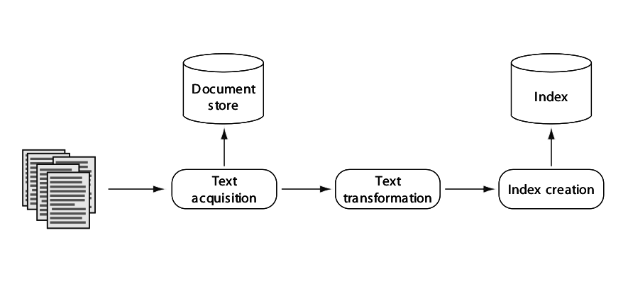
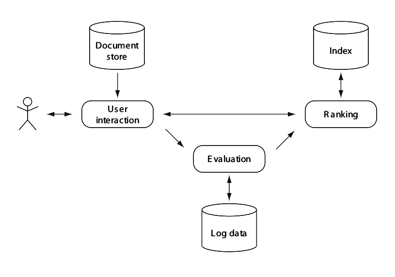

# Web Search and Information Retrieval
## Course Summary

[TOC]

# I: Intro

## What is Information Retrieval?
Information retrieval is the research field that deals with the design, implementation, evaluation, and analysis of systems that help users find useful portions of data
stored on computers.

## Historical Background
### 5-minute exercise

- What are problems when sorting by author?
	- Ambiguous names, same names

- What is necessary to organize library cards by subject?
	- Some kind of topology
	- Some cards will fit into different categories

- Librarians can now dig up books for you by author, by title, by subject. What is still missing?
	- Term search/Full text search

# II: Architecture of a Search Engine

## Requirements for search engines

- Effectiveness
	- Quality / Most relevant set of documents for a query
		Needs: Sophisticated text statistics

- Efficiency
 	- Speed / Process queries as quickly as possible
 		Needs: Special data structures

## Two processes
- Indexing: Build structures that enable searching
- Query: Use structures + query for ranking

## Indexing building blocks

---

## Indexing

### Text acquisition
__Task__: Identify and make available documents to be searched

Components:

- Crawler
- Feed Reader
- Converter
- Document Store

### Crawler
__Task__: Responsible to identify and acquire documents

Web Crawler: Follows links to discover new web pages

### 2-minute Exercise: What are challenges for web crawling?

- Don't fall into loops
- Keeping freshness / When to recrawl?
- Manage huge volume

### Feed reader
__Task__: Similar to crawling; identify and acquire documents

### Converter
__Task__: Create plain text from crawls and feeds

Problems: Variety of formats, text encoding

### Document store
__Task__: Manage large document collection and metadata

Why? Documents are available on the web?

- Fast access
- Orignal not always accessible

### 2-minute Exercise: Why redundant local mirroring of the documents?

- Keep data close to the user
- Fallback in case of node fallout

### Text transformation
__Task__: Create index terms and features from the text

- Parts of the document are getting stored in the index and are used for searching
- Index terms can be: words, phrases, named entities, dates, links, etc.

Components:

- Parser
- Stopping
- Stemmer / Lemmatizer
- Link Extraction
- Information Extraction
- Classifier

#### Parser
__Task__: Process token sequence and recognize document structure (title, body, . . . )

- Tokenizing the text
- Important: Query has to be tokenized the same way!
- Keeping important information about document (e.g. words in heading more important than in body)

### 2-minute exercise: What might be problems with alphanumeric tokens?

- Special chars
- Uppercase/Lowercase
- Apostrophe: O'Connor - Owner's

#### Stopping
__Task__: Remove common words from token stream
- Problem: "to be or not to be"

#### Stemmer / Lemmatizer
__Task__: Group words from a common stem

- Idea: "statistics" should also match “statistic” and “statistical”

Stemming can produce non-word terms. Lemmatizing keeps terms readable.

### 2-minute exercise: What are problems related to aggressive stemming?

- Can cause false postives.

#### Link extraction
__Task__: Extract links and anchor texts

- Anchor text often describes the page the link points to
- Link analysis like PageRank makes extensive use of link structure
- Anchors enhance text content of the linked document
- Links and anchors can significantly improve effectiveness

#### Information extraction
__Task__: Identify more complex index terms

- Words in bold or headings
- Noun phrase detection through POS (part-of-speech) tagging
- Named entity recognition (names, companies, locations, dates, phone numbers, ...)

#### Classifier
__Task__: Identify and assign class-related metadata

- Assign labels (categories) to documents
- Spam classification
- Non-content part identification (Ads)
- Clustering used to group without predefined categories: Importand for ranking and user interaction

### Index creation
__Task__: Create data structures from transformed text

- Must be efficient with respect to time and space
- Efficient updates
- Common form: Inverted Index
- Particular form is very important

Components:

- Document statistics
- Weighting
- Inversion
- Distribution

#### Document statistics
__Task__: Gather and record statistical information about words, features, documents

- Frequencies of index terms
- Position of index terms in documents
- Frequencies over document groups
- Document lengths
- Statistics stored in lookup tables

- Reieval model and ranking determine the required statistics!

#### Weighting
__Task__: Calculate weights for words in documents

- Index term weights reflect relative importance in documents: Needed for ranking
- Pre-computed due to efficiency
- tf-idf:
	- Idea: High weights for terms that occur in few documents
	- tf: term frequency - occurences in document
	- idf: inverse document frequency - occurences in collection

#### Inversion
__Task__: Change document-term information to term-document information

#### Distribution
__Task__: Distribute index over multiple computers and network sites

- Either document or term distribution
- Replication

### 2-minute exercise: What are arguments for sharding by documents, by terms, and replication?

- documents: smaller indexes are faster.
- term: based on query terms, only a few machines need to be accessed
- replication: faster access to closer machine, fallback in case of fallouts

---

## Query Process

### User interaction
__Task__: Interface between the user and the search engine

- Accept user query and transform into index tersm
- Take ranked list from se and organize into results
- Offer query refinements

Components:

- Query input
- Query transformation
- Results output

#### Query input
__Task__: Provide interface and parser for query language

- In state-of-art web search mostly simple query languages but variety of operators possible

#### Query transformation
__Task__: Improve initial query

- Tokenizing, stopping, stemming as with documents
- Spell checking and query suggestion
- Query expansion
	- Suggest or add additional terms. Usually from analyzing term occurrences in documents
	- Relevance feedback expands by terms from user-identified relevant documents or simply terms from the top search results

### 2-minute exercise: What problems do you see with relevance feedback?

- Might be difficult to identify what is relevant to a user
- Using top ranked documents might lead to topic drift

#### Results output
__Task__: Constructing the display of ranked documents

- Snippet generation
- Highlighting important words
- Clustering the output to show groups of related documents
- Find and display ads
- Even translation of results from other languages

### Ranking
__Task__: Generate ranked list of documents

- Core of a search engine
- Must be efficient (many queries in short time) and effective (relevant results)
- Efficiency depends on indexes, effectiveness on retrieval model

Components:

- Scoring
- Optimization
- Distribution

#### Scoring
__Task__: Calculate scores for documents

- Based on the ranking algorithm (which is based on the retrieval model)
- Features and weights used must be related to topical and user relevance
- Basic form: q_i * d_i

### 2-minute exercise: Can you imagine what the difference between topical and user relevance is?

TODO

#### Optimization
__Task__: Design ranking algorithms and indexes to decrease response time and increase throughput

- Term-at-a-time scoring
	- Access index for a query term
	- Compute contribution of that term for a document’s score
	- Add contribution to an accumulator (score for a document is only available at the end)
	- Access next index

- Document-at-a-time scoring
	- Access all query term indexes in parallel
	- Compute scores by moving pointers through the indexes to find documents with all the terms
	- Final document score calculated immediately

#### Distribution
__Task__: Decide how to allocate queries to processors and assemble final ranked list

- Query broker depends on form of index distribution
- Which shards/replicated copy to access?
- Caching

### Evaluation
__Task__: Measure and monitor effectiveness and efficiency

- Record and analyze log data (user + system logs)
- Results used to tune ranking
- Offline activity (apart from logging)
- Critical part of any search application

Components:

- Logging
- Ranking analysis
- Performance analysis

#### Logging
__Task__: Log users’ queries and interactions

- Most valuable source of information for tuning effectiveness and efficiency
- Query logs useful for spell checking, query suggestion, query caching, match ads, etc.
- Clicked documents tend to be relevant
- Clickthrough data is important
- Also dwell time (time spent reading a document)
- Click-through often used to train ranking algorithms (learning-to-rank framework)

#### Ranking analysis
__Task__: Measure and compare effectiveness via logs and relevance judgments

- Explicit relevance judgments for (query, document) pairs
- Costly but extremely valuable source for parameter tuning
- Often crowdsourcing is applied to gather judgments
- Variety of evaluation measures available
- In web search measures that emphasize the quality of the top results are common

#### Performance analysis
__Task__: Monitoring and improving system performance

- Typical measures are response time and throughput
- In distributed environments network congestion also important
- Controlled environment via test collections
- Also simulation as a possibility

## Summary

- Two main processes: indexing and query process
- Indexing process: text acquisition, text transformation, index creation
- Query process: user interaction, ranking, evaluation
- Document store and index as the connections
- Logs as important means for parameter tuning

---

# III: Crawling, Parsing, Information Extraction

## Crawling the Web

### What to search?

What should we index and search?

- Simple answer: Everything you can!
	- Every document answers at least one question: “Where was that document again?”

Challenges:
- Web scale: tens of billions pages
- Owner may not want his page indexed
- No clue about the number of pages a website has
- Hidden data (behind forms)

#### Retrieving web pages

- Each page has a unique uniform resourse locator (URL)
- Crawlers fetch pages in the same way as a web browser
- GET is most common, POST also possible

#### The crawling process

1) Start with a set of seed URLs
2) URLs are added to request queue (also called frontier)
3) Crawler starts fetching URLs from queue
4) Identifying links on downloaded pages
5) New URLs are added to frontier
6) Repeat until frontier empty (or disk full)

- Single thread is not efficent
	Most of time would be spent waiting for the DNS and building up the connection

- Inefficiency reduced by threading: fetching hundreds of pages in parallel
- Regard politeness: Don't try to fetch a lot of pages from one server at once

#### Politeness

Don't pull too many pages from one server at once

Solution: Split frontier into queues with a timer. Crawler is only allowed to read from "free" queues.

__Example__::

- 100 pages can be fetched per second
- Politeness policy expects 30s waiting before fetching from same server again
- This leads to at least 3000 distinct servers in the frontier to guarantee full workload
- 3000 distinct servers means ~10.000 URLs in frontier

#### robots.txt

- Admin file that tells Crawler if and where crawling is allowed
- Optional sitemap can hint to (hidden) pages

#### Freshness

- Web pages are changing constantly
- Crawler has to revisit pages to keep index up to date
- HTTP request HEAD allows to check for changes without downloading the whole page
- Different pages change with different frequencies: News Page - Researchers home page
- Crawlers need to monitor these change rates to adopt recrawl intervals

#### Freshness metric

- A page is fresh if the crawler has the latest copy (otherwise it's stale)
- Freshness is the fraction of fresh pages over the total pages

### 2-minute exercise: What is the problem when you optimize for freshness?

An optimization algorithm that focuses on freshness would at some point ignore pages that change frequently.

__Age metric is better__

#### Age metric

- Age of an page will grow depending on it's change rate and the time that has been passed since the last crawl
- Frequently changing pages will age faster then not so often changing pages
- Crawler will try to recrawl pages with high age

#### Distributed crawling

- For crawling the entire web, more machines do make sense
	Put Crawler closer to the sites he needs to crawl to reduce connection throughput

- Distributed crawler uses a hash function to assign URLs to crawling computers
	- Hash should be computed on the host part of URL: All URLs from some host on same crawler

__Example__:

- Crawler has 1MB/s network connection
- With web page size of 20KB, it can copy 50 pages per second
- Close sites may have data transfer rate of 1MB/s
- But probably 80ms waiting for opening connection (latency)
- Results in 100ms per page request (20ms data transfer)
- 50 pages times 100ms gives 5 seconds for transferring 50 pages with just one connection
- Five connections needed to transfer 50 pages in one second

### 2-minute exercise: Now suppose sites are further away with only 100KB/s throughput and 500ms latency. How many connections do you need?

- 100KB/s means 200ms for data transfer of 20KB
- Results in 700ms per page request (200ms data transfer + 500ms latency)
- 50 pages times 700ms yields 35 seconds
- 35 connections to transfer 50 pages in one second!

#### Big crawling problem: the deep web

- Sites that are difficult for a crawler to find are referred to as the deep web (or hidden web); assumed to be much much larger than conventional web

- Three broad categories
	- Private sites
		No incoming links, or may require login with a valid account
		Example: some news pages (who might still want to get indexed)
	- Form results
		Sites that can be reached only after entering some data into a form
		Example: flight ticket selling (enter destination + dates etc.)
	- Scripted pages
		Pages that generate links via JavaScript or other client-side languages
		Crawler needs to execute scripts
		Significantly slows down the whole proces

## Conversion

### Character encoding

- Character encoding is a mapping between bits and glyphs
- English: ASCII (1 byte)
- European (most): Latin-1 (ISO-8859-1)
- Documents lie about their encoding!
- Other languages can have many more glyphs
	Chinese has more than 40,000 characters, with over 3,000 in common use
- Unicode developed to address encoding problems

### Unicode

- Single mapping from numbers to glyphs that attempts to include all glyphs in common use in all known languages
- UTF-8 Uses one byte for English (ASCII), as many as 4 bytes for some traditional Chinese characters
- UTF-32 uses 4 bytes for every character

## Storing Documents

### Creating the document store
- Many reasons to store converted document text
	- Saves crawling time when page is not updated
	- Provides efficient access to text for snippet generation, information extraction, etc.
- Database systems can provide document storage for some applications
	- Web search engines use customized document storage systems

### Requirements for document storage systems

- Random access
	Request content by URL (typically hash function based)
- Compression and large files
- Update

### Large files

## Parsing Documents

## Link Analysis

## Information Extraction

